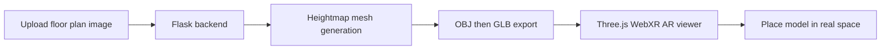

# AR Floor Plans — 2D Floor Plan to Augmented Reality (WebXR)

Convert **2D floor plan images** into **interactive 3D models** and view them in **Augmented Reality** on supported mobile browsers. Built with **Python Flask**, **Three.js WebXR**, and **glTF/GLB** export for real-world placement using hit-test AR.

> **Academic context:** This repository is a **sub-part of a Bachelor's final-year project**, focused on bridging architectural floor plans and immersive AR visualization for education and prototyping.

[](https://www.python.org/)
[](https://flask.palletsprojects.com/)
[](https://threejs.org/)
[](LICENSE)

---

## Table of Contents

- [Overview](#overview)
- [Features](#features)
- [How It Works](#how-it-works)
- [Tech Stack](#tech-stack)
- [Prerequisites](#prerequisites)
- [Installation](#installation)
- [Usage](#usage)
- [Project Structure](#project-structure)
- [Deployment](#deployment)
- [Browser & Device Support](#browser--device-support)
- [Bachelor Final Year Project](#bachelor-final-year-project)
- [Contributing](#contributing)
- [Author](#author)
- [Keywords](#keywords)

---

## Overview

**AR Floor Plans** is an open-source web application that turns flat **floor plan images** (PNG, JPG) into **3D heightmap meshes** and loads them in an **AR viewer** powered by **WebXR**. Upload a plan, generate a **GLB model**, then place and inspect the layout in your physical space—useful for architecture students, interior design demos, and AR prototyping without native mobile apps.

### Why this project?

| Problem | Solution |
|--------|----------|
| 2D plans are hard to spatially understand | Heightmap-based 3D mesh from image luminance |
| Native AR apps are costly to build | Browser-based **WebXR** with **Three.js** |
| Manual 3D modeling is slow | Automated **image → OBJ → GLB** pipeline |

---

## Features

- **Image upload** — Drag-and-drop or file picker for floor plan images (up to 16 MB)
- **2D to 3D conversion** — Grayscale heightmap extrusion into a triangulated mesh
- **GLB export** — Industry-standard **glTF Binary** for web and AR viewers
- **WebXR AR** — Hit-test placement, reticle targeting, tap-to-place clones
- **Responsive UI** — Bootstrap 5 upload flow with loading and progress feedback
- **Alternate viewers** — Dedicated AR viewer route and **Google Model Viewer** template
- **Cloud-ready** — **Gunicorn** + **Procfile** for Heroku-style deployment

---

## How It Works



1. User uploads a **2D floor plan** via the web interface.
2. The backend reads pixel intensity and builds a **3D heightmap** (brighter pixels = higher elevation).
3. Vertices and faces are written as **OBJ**, then exported to **GLB** with **Trimesh**.
4. The frontend loads the GLB with **GLTFLoader** and launches **WebXR AR** with surface hit-testing.
5. User taps to **place** scaled model instances on detected planes.

---

## Tech Stack

| Layer | Technologies |
|-------|----------------|
| **Backend** | [Flask](https://flask.palletsprojects.com/), [Gunicorn](https://gunicorn.org/) |
| **3D processing** | [NumPy](https://numpy.org/), [Pillow](https://python-pillow.org/), [Trimesh](https://trimsh.org/), [pygltflib](https://github.com/KhronosGroup/pyGLTF) |
| **Frontend / AR** | [Three.js](https://threejs.org/) (WebXR, GLTFLoader, ARButton), [Bootstrap 5](https://getbootstrap.com/) |
| **Formats** | PNG/JPG → OBJ → **GLB** (glTF 2.0) |
| **Deployment** | Heroku-compatible (`Procfile`, `runtime.txt`) |

---

## Prerequisites

- **Python 3.11** (see `runtime.txt`)
- **pip** and a virtual environment (recommended)
- For AR testing: **Android Chrome** or **iOS Safari** on a device with **ARCore** / **ARKit** support
- HTTPS or `localhost` for WebXR (required by browsers)

---

## Installation

```bash
# Clone the repository
git clone https://github.com/danishjavedcodes/AR-Floor-Plans.git
cd AR-Floor-Plans

# Create and activate a virtual environment
python3 -m venv venv
source venv/bin/activate   # Windows: venv\Scripts\activate

# Install dependencies
pip install -r requirements.txt
```

Ensure upload directories exist (created automatically on first run):

- `static/textures/` — uploaded images  
- `static/models/` — generated GLB files  

---

## Usage

### Run locally

```bash
export FLASK_APP=app.py
python app.py
```

Open **http://localhost:5002** (default port from `app.py`).

### Workflow

1. Open the home page and **upload** a floor plan image.
2. Wait for **conversion** to complete (image → 3D GLB).
3. Tap **Enter AR** when prompted (WebXR-capable device).
4. Point the camera at a flat surface; use **hit-test reticle** and tap to **place** the model.
5. Optional: open `/ar_viewer?model=<filename>.glb` for a standalone AR session.

### Standalone model generation (CLI)

`generate_model.py` includes utilities for **OBJ/GLB heightmap** generation and optional Plotly visualization:

```bash
python generate_model.py
```

Adjust `input_image` and `output_glb` paths in the script’s `__main__` block for local experiments.

---

## Project Structure

```
AR-Floor-Plans/
├── app.py                 # Flask routes: upload, convert, AR viewer
├── generate_model.py      # Image → heightmap → OBJ/GLB pipeline
├── requirements.txt       # Python dependencies
├── Procfile               # Gunicorn entry for production
├── runtime.txt            # Python version for deploy platforms
├── templates/
│   ├── index.html         # Upload + integrated WebXR AR flow
│   ├── ar_viewer.html     # Dedicated Three.js AR viewer
│   └── viewer.html        # Model Viewer (WebXR / Scene Viewer / Quick Look)
├── static/
│   ├── textures/          # Uploaded floor plan images
│   └── models/            # Generated GLB models
└── public/fonts/          # Font assets
```

---

## Deployment

Deploy to **Heroku** or similar PaaS:

```bash
# Heroku example
heroku create your-ar-floor-plans-app
git push heroku main
```

The `Procfile` runs:

```
web: gunicorn app:app
```

Set `PORT` via the platform; the app reads `os.environ.get('PORT', 5002)`.

> **Note:** Use **HTTPS** in production so **WebXR AR** is available on mobile browsers.

---

## Browser & Device Support

| Capability | Requirement |
|------------|-------------|
| **WebXR AR** | Chrome Android (ARCore), Safari iOS (ARKit) |
| **Desktop preview** | 3D load may work; AR session typically requires mobile |
| **Model Viewer route** | `templates/viewer.html` supports WebXR, Scene Viewer, Quick Look |

---

## Bachelor Final Year Project

This codebase is developed as a **sub-component of a Bachelor's final-year project**. It explores:

- Automated **2D-to-3D** reconstruction from architectural floor plans  
- **Web-based Augmented Reality** without platform-specific SDKs  
- Practical pipelines for **education**, **real estate visualization**, and **HCI research**

Related modules of the full thesis (e.g., scanning, room mapping, or backend services) may live in separate repositories; this repo focuses specifically on **AR floor plan visualization**.

---

## Contributing

Contributions are welcome. To propose changes:

1. Fork the repository  
2. Create a feature branch (`git checkout -b feature/your-feature`)  
3. Commit with clear messages  
4. Open a Pull Request  

Please keep PRs focused and include steps to reproduce AR behavior on a supported device when relevant.

---

## Author

**Danish Javed** — [github.com/danishjavedcodes](https://github.com/danishjavedcodes)

Repository: [https://github.com/danishjavedcodes/AR-Floor-Plans](https://github.com/danishjavedcodes/AR-Floor-Plans)

---

## Keywords

`augmented reality`, `AR floor plans`, `WebXR`, `Three.js`, `2D to 3D conversion`, `floor plan visualization`, `glTF`, `GLB`, `heightmap mesh`, `Flask`, `Python AR`, `architectural visualization`, `real estate AR`, `bachelor project`, `final year project`, `image to 3D model`, `hit-test AR`, `mobile AR browser`

---

## License

This project is intended for academic and educational use as part of a Bachelor's final-year submission. Add a `LICENSE` file (e.g., MIT) if you wish to formalize redistribution terms.
